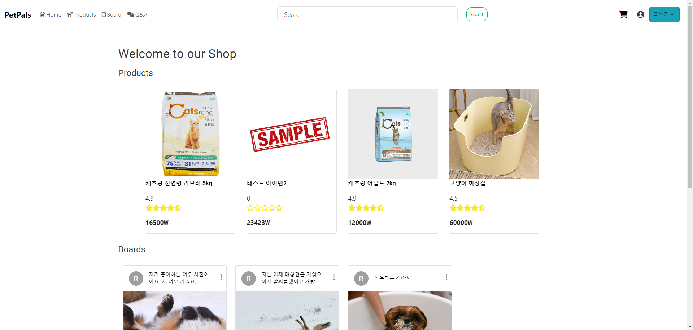

# PetPals Project



# 가동 방법

본 홈페이지를 가동하는 데에는 터미널 두 개가 필요합니다.
먼저 프로젝트를 git clone 합니다.

```
git clone
pip install -r requirements.txt
```

### Backend

```
ce be
python manage.py runserver
```

### Frontend

```
ce fe
npm init
npm i

만약 오류가 발생할 경우
npm install --force redux-devtools-extension

이후 추가 설치
npm i --force @ckeditor/ckeditor5-react @ckeditor/ckeditor5-build-classic
npm install --force @mui/material @emotion/react @emotion/styled @mui/material @mui/styled-engine-sc styled-components  @fontsource/roboto  @material-ui/core @mui/icons-material @mui/x-charts
npm install react-icons

만약 설치 중 오류 발생 시
npm i --force react-icons
```